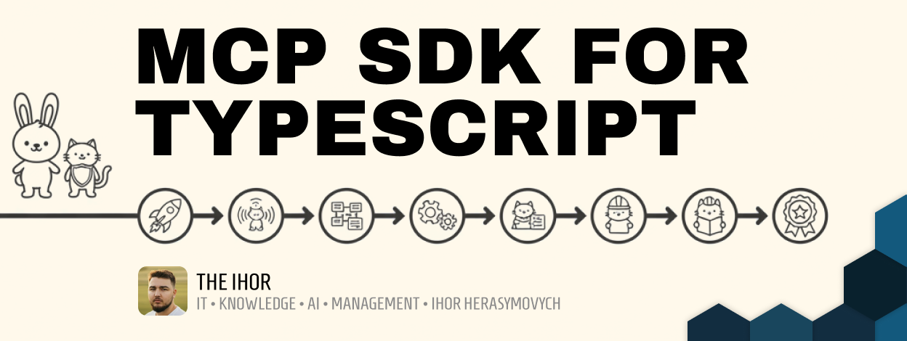

# MCP SDK for TypeScript



Production-ready Model Context Protocol (MCP) SDK for TypeScript with automatic runtime optimization (Bun/Node.js), advanced streamable HTTP transport, comprehensive error handling, and enterprise-grade session management.

## ✨ Features

- 🚀 **Runtime Optimized**: Automatically detects and optimizes for Bun or Node.js
- ⚡ **High Performance**: Uses Bun.serve when available, graceful Node.js fallback
- 🔄 **Real-Time Communication**: Streamable HTTP transport with Server-Sent Events (SSE)
- 🛡️ **Type Safety**: Full TypeScript support with Zod schema validation
- 📡 **Session Management**: Advanced request-response correlation and session tracking
- 🔧 **Generator-Based Tools**: Async generator pattern for streaming responses
- 🛠️ **Production Ready**: Comprehensive error handling and memory management
- 📚 **Well Documented**: Enterprise-grade JSDoc documentation
- 🎯 **MCP Compliant**: Full support for MCP 2025-03-26 specification
- 🔌 **Universal Compatibility**: Works seamlessly in both Bun and Node.js environments

## 🚀 Quick Start

### Create a New MCP Server (Recommended)

The fastest way to get started is with our CLI tool:

```bash
# Create a new MCP server project
bunx @the-ihor/adi-create-mcp-server
# or
npx @the-ihor/adi-create-mcp-server
```

This interactive CLI will:
- ✨ Set up a complete MCP server project
- 🎯 Include example tools (echo, random number generator)
- 📦 Support multiple package managers (Bun, npm, yarn, pnpm)
- 🔧 Generate proper TypeScript configuration
- 📚 Include comprehensive documentation

### Manual Installation

```bash
# Using Bun (recommended for performance)
bun add @the-ihor/mcp-sdk-typescript

# Using npm/Node.js
npm install @the-ihor/mcp-sdk-typescript

# Using yarn
yarn add @the-ihor/mcp-sdk-typescript
```

## 📖 Manual Implementation

```typescript
import { MCPApp, TextResponse, ProgressResponse, LogResponse, z } from "@the-ihor/mcp-sdk-typescript";

const app = new MCPApp({
  name: "my-mcp-server",
  version: "1.0.0",
  transport: {
    host: "localhost",
    port: 3000,
    path: "/mcp"
  }
});

// Create tools with streaming responses
app
  .createTool({
    name: "process-data",
    description: "Process data with real-time progress updates",
    schema: z.object({
      data: z.array(z.string()).describe("Data items to process"),
      delay: z.number().optional().default(100).describe("Processing delay in ms")
    }),
    handler: async function* (args) {
      yield new LogResponse("Starting data processing", "info");
      
      for (let i = 0; i < args.data.length; i++) {
        yield new ProgressResponse(`Processing item ${i + 1}`, i + 1, args.data.length);
        
        // Simulate processing
        await new Promise(resolve => setTimeout(resolve, args.delay));
        
        yield new TextResponse(`Processed: ${args.data[i]}`);
      }
      
      yield new LogResponse("Processing completed", "info");
    }
  })
  .createTool({
    name: "echo",
    description: "Echo back input with optional transformations",
    schema: z.object({
      text: z.string().describe("Text to echo"),
      uppercase: z.boolean().optional().describe("Convert to uppercase"),
      repeat: z.number().min(1).max(10).optional().default(1).describe("Number of repetitions")
    }),
    handler: async function* (args) {
      let result = args.uppercase ? args.text.toUpperCase() : args.text;
      
      for (let i = 0; i < args.repeat; i++) {
        yield new TextResponse(`Echo ${i + 1}: ${result}`);
      }
    }
  });

// Start the server
await app.start();
console.log("🎯 MCP Server running and ready for connections!");
```

## 🏗️ Architecture

### Core Components

#### **MCPApp**
Main application class providing:
- Type-safe tool registration with automatic validation
- Server lifecycle management
- Built-in error handling and logging

#### **StreamableHttpTransport**
Advanced HTTP transport featuring:
- **Runtime Detection**: Automatically uses optimal server implementation
- **Bun Optimization**: Uses Bun.serve for maximum performance when available
- **Node.js Compatibility**: Seamless fallback to Node.js HTTP server
- **Session Correlation**: Request-response mapping for proper delivery
- **Real-Time Streaming**: Server-Sent Events for immediate responses
- **Error Recovery**: Comprehensive fallback mechanisms
- **Memory Management**: Automatic cleanup of expired requests

#### **Response System**
Rich response types for various content:
- **TextResponse**: Plain text content
- **ImageResponse**: Images with MIME type support
- **ResourceResponse**: File and URL references
- **ProgressResponse**: Real-time progress updates
- **LogResponse**: Structured logging with levels
- **ErrorResponse**: Typed error information
- **RawResponse**: Custom content types

## 🔧 Advanced Usage

### Error Handling

```typescript
const transport = new StreamableHttpTransport({
  host: "localhost",
  port: 3000,
  path: "/mcp"
});

// Handle transport-level errors
transport.onError((error) => {
  console.error("Transport error:", error.message);
  // Error context: "Server startup failed: ..." 
  // Error context: "Failed to parse JSON-RPC message: ..."
});

// Handle application errors
app.createTool({
  name: "risky-operation",
  schema: z.object({ value: z.number() }),
  handler: async function* (args) {
    try {
      if (args.value < 0) {
        yield new ErrorResponse("Negative values not allowed", "INVALID_INPUT");
        return;
      }
      yield new TextResponse(`Result: ${Math.sqrt(args.value)}`);
    } catch (error) {
      yield new ErrorResponse(`Unexpected error: ${error.message}`, "INTERNAL_ERROR");
    }
  }
});
```

### Session Management

The transport automatically handles session correlation:

```typescript
// Client establishes SSE connection: GET /mcp
// Server returns X-Session-ID header
// Client sends requests with session ID: POST /mcp + X-Session-ID header
// Server routes responses back to correct client via SSE stream
```

## 🛠️ Development

### Using Bun (Recommended)
```bash
# Install dependencies
bun install

# Build the library
bun run build

# Type checking
bun run typecheck

# Linting
bun run lint
bun run lint:fix

# Run tests
bun test
```

### Using Node.js
```bash
# Install dependencies
npm install

# Build the library (requires Bun for build process)
npm run build

# Type checking
npm run typecheck

# Linting
npm run lint

# Run tests
npm test
```

### Runtime Detection
The SDK automatically detects your runtime:
```typescript
// Will use Bun.serve if running in Bun
// Will use Node.js HTTP server if running in Node.js
const app = new MCPApp({ name: 'my-app', version: '1.0.0' });
await app.start(); // Optimized for your runtime!
```

## 📁 Project Structure

```
mcp-sdk-typescript/
├── src/
│   ├── app.ts          # Main MCPApp class
│   ├── transport.ts    # HTTP transport with runtime detection
│   ├── responses.ts    # Response type definitions
│   ├── schemas.ts      # Schema utilities and validation
│   └── index.ts        # Public API exports
├── dist/               # Build output
├── docs/               # Additional documentation
└── tests/              # Test suites
```

## 🤝 Contributing

1. Fork the repository
2. Create a feature branch: `git checkout -b feature/amazing-feature`
3. Make changes and add tests
4. Ensure linting passes: `bun run lint`
5. Commit changes: `git commit -m "✨ feat: Add amazing feature"`
6. Push to branch: `git push origin feature/amazing-feature`
7. Open a Pull Request

## 📄 License

MIT License - see [LICENSE](LICENSE) file for details.

## 🔗 Links

- **GitHub**: [mcp-sdk-typescript](https://github.com/the-ihor/mcp-sdk-typescript)
- **CLI Tool**: [adi-create-mcp-server](https://github.com/the-ihor/adi-create-mcp-server) - Create MCP servers instantly
- **NPM Package**: [@the-ihor/adi-create-mcp-server](https://www.npmjs.com/package/@the-ihor/adi-create-mcp-server)
- **Issues**: [Report bugs](https://github.com/the-ihor/mcp-sdk-typescript/issues)
- **MCP Specification**: [Model Context Protocol](https://modelcontextprotocol.io)
- **Bun Runtime**: [Bun.sh](https://bun.sh)
- **Node.js Runtime**: [Node.js](https://nodejs.org)

---

Built with ❤️ by **The Ihor** using [Bun](https://bun.sh), [TypeScript](https://typescriptlang.org), and [Claude](https://claude.ai)